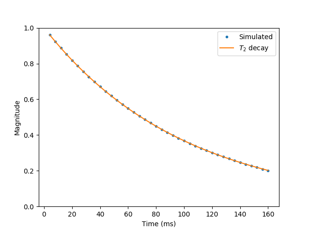

# Sycomore &mdash; an MRI simulation toolkit

Sycomore is an MRI simulation toolkit providing Bloch simulation, Extended Phase Graphs (EPG) (both regular and discrete, including 3D), and Configuration Models. Sycomore is a Python packge in which all computationnaly-intensive operations are run by a C++ backend, providing a very fast runtime and further acceleration through [OpenMP](https://www.openmp.org/).

## Installation

Sycomore requires a C++11 compiler, Python (>= 3.5) and [pybind11](http://pybind11.readthedocs.io/). To take full advantage of your CPU, OpenMP is strongly recommended. If you want to validate your build of Sycomore, you should run the unit tests, which require [Boost.Test](https://www.boost.org/doc/libs/release/libs/test/). Sycomore uses [CMake](https://cmake.org/), so the simplest way to build it would be to create a *build* directory inside the source directory, run *cmake*, then run *make*:

```shell
mkdir build
cd build
cmake ..
make
```

Additional details are provided in the [documentation](https://sycomore.readthedocs.io/en/latest/installation.html).

## Usage

The following code simulates a single repetition of a simple RARE sequence and plots the transverse magnetization of each echo.

```python
import matplotlib.pyplot
import numpy
import sycomore
from sycomore.units import *

species = sycomore.Species(1000*ms, 100*ms, 1*um**2/ms)
TE = 4*ms
train_length = 40

model = sycomore.epg.Regular(species)
data = numpy.zeros(train_length, dtype=[("time", sycomore.Quantity), ("signal", complex)])

model.apply_pulse(90*deg)
for echo in range(train_length):
    model.apply_time_interval(TE/2)
    model.apply_pulse(180*deg)
    model.apply_time_interval(TE/2)
    
    data[echo] = (((1+echo)*TE), model.echo)

times = [x.convert_to(ms) for x in data["time"]]
magnitude = numpy.abs(data["signal"])
matplotlib.pyplot.plot(times, magnitude, ".", label="Simulated")
matplotlib.pyplot.plot(
    times, [numpy.exp(-(x*species.R2).magnitude) for x in data["time"]],
    label="$T_2$ decay")

matplotlib.pyplot.ylim(0,1)
matplotlib.pyplot.xlabel("Time (ms)")
matplotlib.pyplot.ylabel("Magnitude")
matplotlib.pyplot.legend()
matplotlib.pyplot.show()
```



The features and data structures are described in the documentation:

- [Common features](https://sycomore.readthedocs.io/en/latest/common_features.html)
- [Bloch simulation](https://sycomore.readthedocs.io/en/latest/bloch.html)
- [Extended Phase Graphs](https://sycomore.readthedocs.io/en/latest/epg/index.html)
- [Configuration Models](https://sycomore.readthedocs.io/en/latest/como.html)
